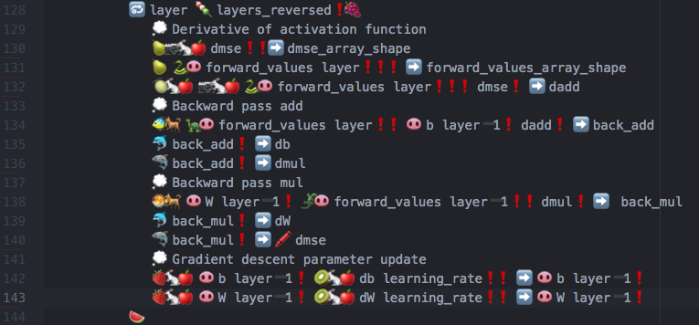
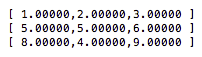
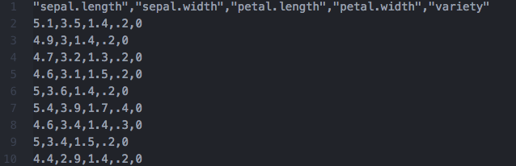

# emoji-learn

## Whats is emoji-learn? 🤔

emoji-learns is a simple library to create neural networks - in [Emojicode](https://www.emojicode.org)!  
How can this not be awesome??

## Motivation
n/a

## Look and Feel
So...how does machine learning in Emojicode actually look like?? Here are some screenshots to save you an extra click to my GitHub repo:




Yeah, it really is someting.

## Prerequisites 📝
Emojicode version 0.9+ is required. Go [here](https://github.com/emojicode/emojicode) to find out how to install it.  
If you want to find out how to use Emojicode go through the excellent [language reference](https://www.emojicode.org/docs/reference/) or [package index](https://www.emojicode.org/docs/packages/).  

After you cloned the repository you at first have to build the numlol package. Go to packages/numlol and run the command

```
emojicodec -p numlol numlol.emojic
```

This will generate the numlol package.The emoji-learn package depends on this. So afterwards go to packages/emoji-learn and run

```
emojicodec -p emoji-learn -S /path/to/GitRepo/emoji-learn/packages emoji-learn.emojic
```


## Documentation 🤓

## numlol 💯
Machine learning and especially neural nets rely heavily on the use of linear algebra (LinAlg) - we need to add, substract and multiply matrices and vectors. Unfortunately, the only data structure available in the standard Emojicode package that comes close to what we need are lists. 

```
💭 A list of integers
🍨 1 2 3 4 5🍆
```

Because of this emoji-learn ships with a dedicated LinAlg-library called numlol (not to be confused with the imposters from [numpy](https://numpy.org/)).  
  
Creating a new numlol array is as simple as one-two-three, just hand over an embedded list to its constructor.

```
💭 Create a 3*2 matrix and store it in the variable 'matrix'
  🆕🍎🆕 🍨🍨 1.0 2.0 🍆
            🍨 3.0 4.0 🍆
            🍨 5.0 6.0 🍆🍆 ❗➡️ matrix
            
💭 Create a 3*1 vector and store it in the variable 'vector'
  🆕🍎🆕 🍨🍨 1.0 🍆
            🍨 3.0 🍆
            🍨 5.0 🍆🍆 ❗➡️ vector
```

In the numlol package all kind of matrix and vector operations are implemented:
(Note: most methods are implementes as static methods so that the method name itself is followed by 🐇🍎)  

Want to add two vectors? No problem!

```
💭 Elementwise addition of two arrays with the same shape
🍋🐇🍎 array01 array02❗➡️ sum_array
```

You suddenly need to transpose a matrix? Here you go!

```
💭 Transpose array
🍔🐇🍎 array0❗➡️ transposed_array
```

It is neccesary to perform a matrix-matrix/matrix-vector multiplication? Sure!
```
💭 Do matrix-matrix/matrix-vector multiplication
🥐🐇🍎 array01 array02❗➡️ multiplied_array
```

It also contains some more complicated functions we will need for machine learning later, e.g. the mean squared error function (👬) or the logistic activation function (📸).   

It is also easy to print arrays to the console.

```
💭 Print array to console
📠 array❗
```
This will produce an ouput similar to the following



### emoji-learn 📚
Ah, machine learning! The stuff all the cool kids do. So let's dive right into it.  

First of all we need data. A lot of it. At the moment the only way to get data in our net is via a .csv file. So your data should look like this



Then this file content can be transfered into a numlol array with just one method call

```
💭 Read .csv file into numlol array
🦋🐇🕸 🔤datasets/iris.csv🔤❗ ➡️ data
```

This method does not just read the data, but already normalizes the features and performs a one-hot encoding on the labels.
You don't have any datasets you can try out? No problem, we got you! There are already some toy datasets included. 

```
💭 Read the iris dataset into a numlol array
🌺🐇🕸 ❗ ➡️ data

💭 Read the Pima Indians diabetes dataset into a numlol array
🛶🐇🕸 ❗ ➡️ data

💭 Read the sonar dataset into a numlol array
🚢🐇🕸 ❗ ➡️ data
```
Unfortunately an Emojicode method cannot return multiple values. Therefore 'data' is a value type that holds the features ans the labels. There are two methods to access them both.

```
💭 Access features and labels from the 'data' value type
🐬 data❗ ➡️ X
🦈 data❗ ➡️ y
```

Next step is to split the data in a train and a test set. There is also a handy method for this.

```
💭 Split in train and test data
💭 0.333 means that (about) a third of all the data will be in the test data
🐅🐇🕸 X y 0.333❗ ➡️ train_test_data
```

Afterwards we can create our net. The constructor for the net expects just one parameter, a list with integers where each integer defines the number of neurons in each layer. 

```
💭 Create a neural net. This one has:
💭 - 60 neurons in the input layer
💭 - 12 neurons in the hidden layer
💭 - 2 neurons in the output layer
💭 The number of hidden layers is NOT limited to one.
💭 It can be arbitrary (big)
🆕🕸🆕 🍨 60 12 2🍆 ❗➡️ neural_net
```

And now the magic takes place, we can train the net!

```
💭 Train the net with the given data over 100 epochs with a learning rate of 0.1
🦄 neural_net X_train y_train 100 0.1❗
```

To evaluate the performance we can finally calculate and print the accuracy.

```
💭 Train the net with the given data over 100 epochs with a learning rate of 0.1
  🦍 neural_net X_test y_test❗ ➡️ accuracy_test
  😀🍪 🔤Accuracy test data: 🔤 🔡accuracy_test✖️100 2❗🔤%🔤 🍪❗
```

This method can then be used to make predictions. 

```
💭 Get the 3rd sample from the array X, make a prediction and print the result
📠 🦕 neural_net 🥫🐇🍎 X 3❗❗❗
```

## Performance
So, how does an Emojicode net performs on different datasets? I made a 10 fold crossvalidation training each net over 100 epochs, and here are the results (accuracies):

X | Iris dataset | Sonar dataset | Pima Indian diabetes dataset
--- | --- | --- | ---
Train | 0.966 +/- 0.011 | 0.9986 +/- 0.0030 | 0.833 +/- 0.015
Test | 0.98 +/- 0.023 | 0.784 +/- 0.029 | 0.746 +/- 0.026

Wow, not too bad!
